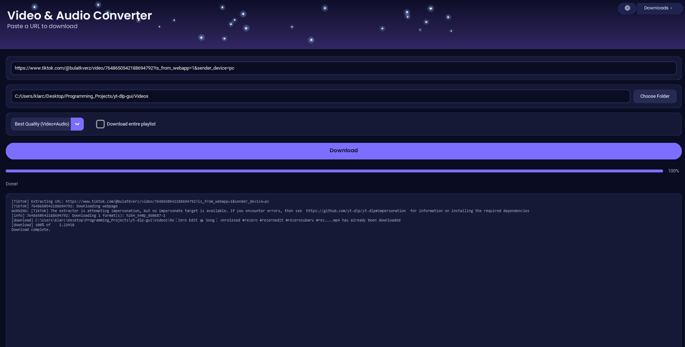
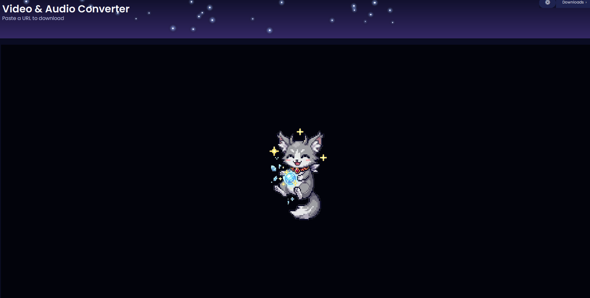

# Video & Audio Converter

A small, modern desktop GUI (CustomTkinter) around [yt-dlp](https://github.com/yt-dlp/yt-dlp)
for downloading and converting videos and playlists — packaged as a standalone Windows `.exe`.

## Download

**[⬇ Download the latest yt-dlp-gui.exe](https://github.com/ClarasC0DE/cute-yt-dlp-converter/releases/latest/download/yt-dlp-gui.exe)**
(~130 MB, ffmpeg is bundled in) — no Python install needed, just run it. See
[Requirements](#requirements) below for the one thing (VLC) that still needs
to be installed separately.

## Screenshots

| Downloading | Celebrating when it's done |
|---|---|
|  |  |

## Features

- Modern dark-theme UI (CustomTkinter) with a custom Poppins font, bundled so it
  looks the same for every user
- Quality presets (Best Quality, 1080p, 720p, 480p, Audio Only as MP3)
- Playlist support
- Live progress display + log output
- Built-in library view ("Downloads" button top right): lists every downloaded
  video/audio file in the destination folder and plays it directly in the app
  (play/pause, seek bar, volume, loop)
- A little cat mascot that celebrates when your download finishes
- ffmpeg/ffprobe are bundled directly in the exe — nothing to install separately
  for merging video/audio or converting to MP3
- Runs as a portable single-file `.exe`

## Requirements

- [VLC Media Player](https://www.videolan.org/vlc/) must be installed for the
  built-in library playback to work (uses `libvlc` via `python-vlc`). Without
  VLC, the rest of the app still works normally — playback just shows a notice.

## Development / run without building an exe

```powershell
py -m venv .venv
.venv\Scripts\pip install -r requirements.txt
.venv\Scripts\python main.py
```

Running from source falls back to a system-installed `ffmpeg` on `PATH` unless
`assets\ffmpeg\ffmpeg.exe` is present (run `.\scripts\fetch-ffmpeg.ps1` to fetch it).

## Build the Windows exe

```powershell
.\build.ps1
```

This also fetches `ffmpeg.exe`/`ffprobe.exe` (an LGPL build from
[BtbN/FFmpeg-Builds](https://github.com/BtbN/FFmpeg-Builds)) into `assets\ffmpeg`
the first time, since those binaries are too large to commit to the repo. The
finished `.exe` will be at `dist\yt-dlp-gui.exe`.

## Known limitation

YouTube regularly changes its anti-bot measures, which can make downloads
intermittently fail with errors like `HTTP Error 403`. Updating yt-dlp to the
latest version (`pip install -U yt-dlp`) usually fixes this, since the project
patches around such changes very actively.

## Usage note

This tool only downloads content through the open-source [yt-dlp](https://github.com/yt-dlp/yt-dlp)
library (Unlicense). Please only download content you have the rights to, or
that the platform's terms of service permit.

## License

MIT — see [LICENSE](LICENSE).
